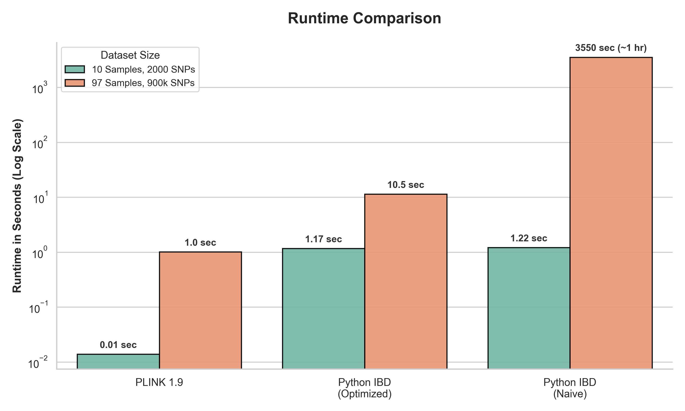
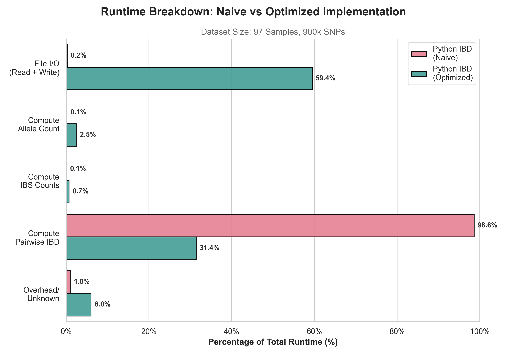

# Plink Method of Moments IBD Reimplementation

## Overview

This project provides a Python implementation of the Methods of Moments algorithm for identity-by-descent (IBD) estimation found in the PLINK 1.9 toolset. The implementation relies on the statistical framework defined by [Purell et al.](https://pmc.ncbi.nlm.nih.gov/articles/PMC1950838/) and the original [PLINK 1.9 source code](https://github.com/chrchang/plink-ng). It calculates the probability of individuals sharing 0, 1, or 2 alleles via inheritance (Z0, Z1, Z2) along with the overall proportion of alleles shared (π^).

## Getting Started

1. Clone the repository using `git clone https://github.com/leo3friedman/plink_method_of_moments_ibd_reimplementation.git`.
2. Navigate into the directory with `cd plink_method_of_moments_ibd_reimplementation`.
3. Create a virtual environment via `python -m venv .env`.
4. Activate the environment using `source .env/bin/activate` for Unix/macOS or `.env\Scripts\activate` for Windows.
5. Install dependencies with `pip install -r requirements.txt`.
6. (Unix/macOS) Grant execution privileges using `chmod +x python_ibd`.
7. Run a small test example with `./python_ibd --input data/subset --out python_ibd.subset`. The IBD output will be written to `python_ibd.subset.genome`.

## Usage

Run the tool using the following syntax: `./python_ibd --input data/in_prefix --out out_prefix`.

### Flags

- **`--input` (Required):** Provide the input prefix (e.g., `data/in_prefix`). The tool automatically assumes the presence of corresponding `.bed`, `.bim`, and `.fam` files in that location. See [PLINK 1.9 specifications](https://www.cog-genomics.org/plink/1.9/formats) for more information on these file types.
- **`--out` (Required):** Specify the output directory and prefix (e.g., `out_dir/out_prefix`).
- **`--naive` (Optional):** Include this flag to run the non-optimized version of the algorithm instead of the default optimized version.

### Output Files

| File Extension | Description                                        | Format                                                                                                |
| -------------- | -------------------------------------------------- | ----------------------------------------------------------------------------------------------------- |
| **`.genome`**  | Contains the computed IBD scores.                  | Plain text. Matches [PLINK 1.9 specification](https://www.cog-genomics.org/plink/1.9/formats#genome). |
| **`.log`**     | Contains log statements from the script execution. | Plain text.                                                                                           |

### Assumed Output Values

While the tool generates a valid `.genome` file according to the [PLINK 1.9 specification](https://www.cog-genomics.org/plink/1.9/formats#genome), it assumes specific default values for fields not calculated by this reimplementation.

| Field                 | Assumed Value |
| --------------------- | ------------- |
| `RT`                  | `'UN'`        |
| `EZ`                  | `'NA'`        |
| `PHE`                 | `-1`          |
| `DST`, `PPC`, `RATIO` | `0`           |

## Provided Datasets

The `data/` directory contains small-scale datasets and their expected PLINK `.genome` outputs for testing and validation. The full-size dataset is excluded from this repository due to size constraints, but its expected output is included as a fixture for testing.

| Dataset    | Variants | Samples | Input Files                              | PLINK output          |
| :--------- | :------- | :------ | :--------------------------------------- | :-------------------- |
| **Micro**  | 10       | 2       | `micro.bed`, `micro.bim`, `micro.fam`,   | `plink.micro.genome`  |
| **Subset** | 2000     | 10      | `subset.bed`, `subset.bim`, `subset.fam` | `plink.subset.genome` |

_Note:_ The provided datasets are subsets of the `~/public/ps2/ibd/ps2_ibd.lwk` dataset found on datahub.ucsd.edu.

## Running the Tests

The test suite verifies the accuracy of both the optimized and `--naive` implementations by comparing their output against the established PLINK 1.9 results.

The suite actively runs both implementations against the `micro` and `subset` datasets. To validate the algorithm at scale, the tests use pre-computed `.genome` fixture files to verify outputs for the full dataset.

You can execute the test suite from the root directory using `pytest`:

`python3 -m pytest tests -v`

## Benchmarking

### Accuracy Results

The accuracy of the Python implementation was validated by comparing its `.genome` output (ran on the full dataset) with PLINK 1.9's `.genome` output via `benchmarking/accuracy.py`. Both the naive and optimized Python implementations produced identical accuracy metrics:

| Column  |       R² |      MAE | Max Error |
| :------ | -------: | -------: | --------: |
| Z0      | 1.000000 | 0.000025 |   0.00005 |
| Z1      | 1.000000 | 0.000014 |   0.00005 |
| Z2      | 0.999991 | 0.000025 |   0.00005 |
| PI_HAT  | 0.999999 | 0.000025 |   0.00005 |
| Overall | 1.000000 | 0.000022 |   0.00005 |

An R² of ~1.0 and near-zero MAE across all columns indicates that both Python implementations effectively match PLINK 1.9's IBD estimates. The maximum error of 0.00005 across all columns is likely due to PLINK rounding its `.genome` output to 4 decimal places.

### Runtime Results

The benchmarks were ran on datahub.ucsd.edu (4 CPU, 16G RAM) against both a small dataset (10 samples, 2000 SNPs) and a larger dataset (97 samples, ~900k SNPs).

#### Runtime Comparison



PLINK 1.9 (compiled C) completes the full dataset in about 1 second. The optimized Python implementation, which uses NumPy matrix operations to vectorize IBS counting and IBD estimation, finishes in roughly 11 seconds. The naive Python implementation, which loops over every variant for every pair of individuals, takes approximately 3,550 seconds (~1 hour).

#### Runtime Breakdown



The breakdown reveals where each implementation spends its time. The naive implementation is dominated by the pairwise IBD computation (~99% of runtime), where a nested Python loop iterates over all 4,656 individual pairs and ~900k variants. The optimized implementation replaces this with matrix multiplications, reducing pairwise IBD to ~31% of runtime. Instead, file I/O (reading the `.bed` file and writing the `.genome` output) becomes the primary bottleneck at ~59%.

### Running the Benchmarks

The `benchmarking/runtime.sh` script times PLINK and both Python implementations (naive and optimized) on the subset and full datasets. It runs 6 benchmarks sequentially, writing results to `<output_directory>/results.txt` and preserving Python `.log` files for per-stage breakdown. It is intended to run on datahub.ucsd.edu only, since the full dataset (`~/public/ps2/ibd/ps2_ibd.lwk`) is only available there.

_Note:_ A full run takes upwards of 1 hour due to the naive implementation.

```bash
bash benchmarking/runtime.sh <output_directory>
```

The `benchmarking/accuracy.py` script compares a target `.genome` file against a ground truth, reporting R², mean absolute error, and max absolute error for each numeric column (Z0, Z1, Z2, PI_HAT).

```bash
python3 benchmarking/accuracy.py <ground_truth.genome> <target.genome>
```

## Project Structure

```
├── python_ibd              # CLI entry point
├── requirements.txt        # Python dependencies
├── src/
│   ├── cli.py              # Argument parsing (--input, --out, --naive)
│   ├── naive.py            # Non-optimized IBD computation (loop-based)
│   ├── optimized.py        # Optimized IBD computation (vector-based)
│   ├── shared.py           # Shared functions across both implementations
│   └── logging.py          # StageLogger class for logging
├── tests/
│   ├── test_naive.py       # Tests for naive implementation
│   ├── test_optimized.py   # Tests for optimized implementation
│   ├── shared.py           # Test helpers (R² calculation, assertions)
│   └── fixtures/           # Pre-computed .genome files for full-dataset validation
├── data/
│   ├── micro.*             # Micro dataset (2 samples, 10 variants)
│   ├── subset.*            # Subset dataset (10 samples, 2000 variants)
│   └── plink.*.genome      # Expected PLINK outputs for each dataset
└── benchmarking/
    ├── runtime.sh          # Runtime benchmarking script
    ├── accuracy.py         # Accuracy benchmarking script
    ├── results.txt         # Wall-clock timings from last benchmark run
    ├── *.png               # Plots of Runtime and Per-stage breakdown
    └── *.log               # Per-stage timing logs from Python implementations
```
